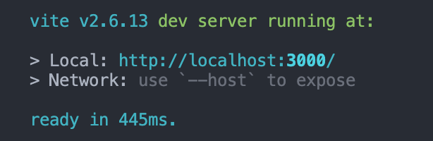

# @arco-design minimal starter with Vite.js, React.js, Typescript

Performant from day 1.
================================================

## Dev server launch in sub second

Thanks to Vite.js and esbuild, the dev server starts in 400ms.



## Icons and styles imported on-demand

checkout `vite.config.ts` plugins object.

```ts
plugins: [
    styleImport({
        libs: [
            // Dynamic import @arco-design styles
            {
                libraryName: "@arco-design/web-react",
                esModule: true,
                resolveStyle: (name) =>
                `@arco-design/web-react/es/${name}/style/index`,
            },
            // Dynamic import @arco-design icons
            {
                libraryName: "@arco-design/web-react/icon",
                libraryNameChangeCase: "pascalCase",
                resolveStyle: (name) =>
                `@arco-design/web-react/icon/react-icon/${name}`,
                resolveComponent: (name) =>
                `@arco-design/web-react/icon/react-icon/${name}`,
            },
        ],
    }),
]
```

## Bundle size optimized

The build process takes only 7s+ (for this starter, this number will grow if your project is getting larger)

With only 1 button component & 2 icons, the output bundle size is around 50kb: 

```shell
$ tsc && vite build
vite v2.6.13 building for production...
✓ 841 modules transformed.
dist/assets/favicon.17e50649.svg      1.49 KiB
dist/index.html                       0.52 KiB
dist/assets/index.5d3250f3.js         1.01 KiB / gzip: 0.53 KiB
dist/assets/index.e3bd17d3.css        39.13 KiB / gzip: 6.66 KiB
dist/assets/arco-design.5c596253.js   142.33 KiB / gzip: 45.32 KiB
✨  Done in 7.84s.
```

## Theming

checkout `vite.config.ts` css object.

```ts
css: {
    preprocessorOptions: {
        less: {
            javascriptEnabled: true,
            // Customize stylings here
            modifyVars: {
                // arcoblue-6 is the primary-color :)))
                "arcoblue-6": "#1DA57A",
            },
        },
    },
},
```

## Others

this repo is minimized to help you understand how it works, just focus on `vite.config.ts`.

Your star is appreciated.